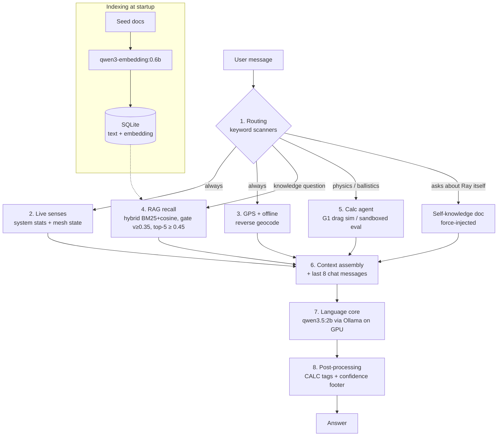

# Ray's Brain — How the Atlas Control AI Thinks

Ray is the local AI assistant inside Atlas Control. It runs **100% offline** on the
Jetson Orin Nano's GPU via [Ollama](https://ollama.com) — no internet, no cloud, no API keys.
Everything below lives in [`ai_manager.py`](ai_manager.py).

> **Ask Ray directly.** Ray carries a copy of this architecture in its knowledge base.
> Open the AI chat and ask things like *"how do you think?"*, *"how do you retrieve
> information?"*, *"explain your thought process"*, or *"why did you say that?"* —
> the self-architecture doc is force-injected and Ray explains itself in first person.

---

## The Diagram

```
                                  ┌─────────────────────────┐
                                  │      YOUR MESSAGE       │
                                  └────────────┬────────────┘
                                               │
                      ┌────────────────────────▼────────────────────────┐
                      │           1. ROUTING (keyword scanners)         │
                      │  live-data? location? math? physics? ballistic? │
                      │  self-question about Ray's own brain?           │
                      └──┬─────────┬─────────┬─────────┬─────────┬──────┘
                         │         │         │         │         │
        ┌────────────────▼──┐ ┌────▼─────┐ ┌─▼───────┐ ┌▼────────▼─────────┐
        │ 2. LIVE SENSES    │ │ 3. GPS / │ │ 4. RAG  │ │ 5. CALC AGENT     │
        │                   │ │ LOCATION │ │ RECALL  │ │ (math cortex)     │
        │ • CPU/GPU/RAM/    │ │          │ │         │ │                   │
        │   temps/power     │ │ M9N fix +│ │ hybrid  │ │ ballistic? ─────┐ │
        │ • mesh nodes      │ │ offline  │ │ cosine  │ │  parse range/   │ │
        │   on/offline      │ │ reverse- │ │ + BM25  │ │  zero/round →   │ │
        │ • channels        │ │ geocode  │ │ gate    │ │  G1 drag-model  │ │
        │ • recent messages │ │ (41k US  │ │ v≥0.35  │ │  simulation     │ │
        │ • telemetry       │ │ ZIPs +   │ │ top-5   │ │ general math? ─┤ │
        │ • topology/SNR    │ │ 68k world│ │ ≥ 0.45  │ │  LLM extracts  │ │
        │ • alerts          │ │ cities)  │ │ score   │ │  [CALC:] exprs │ │
        │                   │ │          │ │         │ │  → sandboxed   │ │
        │ (SQLite, fresh)   │ │          │ │         │ │  evaluator     │ │
        └─────────┬─────────┘ └────┬─────┘ └────┬────┘ └───────┬─────────┘
                  │                │            │              │
                  └──────────┬─────┴──────┬─────┴──────────────┘
                             │            │
              ┌──────────────▼────────────▼───────────────┐
              │        6. CONTEXT ASSEMBLY (working       │
              │              memory for this reply)       │
              │                                           │
              │  system prompt                            │
              │   + SYSTEM STATUS                         │
              │   + CURRENT POSITION (+ nearest city)     │
              │   + MESH NETWORK STATE                    │
              │   + KNOWLEDGE BASE (retrieved docs)       │
              │   + SELF-KNOWLEDGE (if asked about Ray)   │
              │   + CALCULATOR RESULTS (pre-verified)     │
              │   + last 8 chat messages                  │
              └─────────────────────┬─────────────────────┘
                                    │
              ┌─────────────────────▼─────────────────────┐
              │   7. LANGUAGE CORE — qwen3.5:2b @ Ollama  │
              │   Jetson GPU, 4096-token window,          │
              │   temp 0.7, thinking off, streams tokens  │
              └─────────────────────┬─────────────────────┘
                                    │
              ┌─────────────────────▼─────────────────────┐
              │           8. POST-PROCESSING              │
              │  • [CALC: expr] tags → computed values    │
              │  • confidence footer (cannot be faked):   │
              │    HIGH / MEDIUM / LOW + actual sources   │
              └─────────────────────┬─────────────────────┘
                                    │
                            ┌───────▼───────┐
                            │     ANSWER    │
                            └───────────────┘

   OFFLINE INDEXING (startup, background thread)
   ┌──────────────────────────────────────────────────────────────┐
   │ seed docs (survival, comms, ballistics, first aid, app usage,│
   │ Ray self-architecture) ──► qwen3-embedding:0.6b ──► embedding│
   │ vector stored next to the text in SQLite (ai_documents).     │
   │ Edited docs get their embedding cleared and re-embedded.     │
   └──────────────────────────────────────────────────────────────┘
```

Same flow as a Mermaid graph (renders on GitHub):



---

## Stage by stage

### 1. Routing — `_is_location_query`, `_is_math_query`, `_is_physics_query`, `_is_ballistic_query`, `_is_self_query`
Before any model runs, cheap keyword scanners classify the message. This decides which
subsystems wake up: live-data questions skip RAG (the answer is already injected fresh),
physics questions trigger the calculator agent, and questions about Ray itself force-inject
the self-architecture doc.

### 2. Live senses — `build_context()`
Every reply gets fresh system stats (per-core CPU, GPU, RAM, disk, temperatures, power
draw, uptime) and the live mesh picture from SQLite: node online/offline status, battery,
SNR, channels, the last 10 messages, and active alerts. Telemetry, positions, and topology
are injected only when the question asks for them — keeping the context window lean.

### 3. Location grounding — `_build_location_prefix`, `_reverse_geocode`
The SparkFun M9N GPS fix is injected into **every** prompt, reverse-geocoded entirely
offline: US coordinates snap to the nearest of 41,000 ZIP-code centroids (skipping
military-base names when a civilian ZIP is close), everywhere else uses a
gravity-weighted lookup over 68,000 world cities so a nearby town beats a distant
metropolis. If you type coordinates or a place name, that overrides the device fix.

### 4. Indexing & retrieval (RAG, hybrid BM25 + cosine) — `_embed_unembedded_docs`, `rag_search`, `ai_fts_search`
**Indexing:** at startup, every seeded knowledge doc is run through `qwen3-embedding:0.6b`,
producing a 1024-dim vector "fingerprint of meaning" stored next to the text in SQLite.
Each document is embedded as `"title\ntags\n\ncontent"` (embedding format v2) so metadata
keywords like species names and category tags are baked into the semantic fingerprint.
A parallel **FTS5 full-text index** (`ai_documents_fts`) is maintained in the same database
for BM25 keyword search (title weighted 10×, tags 5×, content 1×).
Changed docs are automatically re-embedded and re-indexed.
**Retrieval:** uses a two-pass hybrid approach:
1. Cosine similarity of the query embedding vs every doc.
2. BM25 keyword search across the FTS index.
Hybrid score = `max(v, 0.6·v + 0.4·bm25_norm)` — but only when the cosine similarity
`v ≥ 0.35` (the **semantic plausibility gate**). This means BM25 can rescue a near-miss
semantic candidate (e.g. exact term in doc title) but cannot surface an unrelated doc on
keyword coincidence alone. A keyword-based **topic router** (`_classify_query_category`)
then applies a **+8% score boost** to docs whose tags match the detected category —
so the right cluster surfaces even when border-case scores are close. The top 5 docs
with hybrid score ≥ 0.45 are pasted into the context. The confidence footer is computed
from the raw pre-BM25 cosine score so it can't be inflated. Embeddings are cached in
RAM for 120 s so repeated queries don't hit the database.

### 5. The calculator agent — `_calc_agent_pass`, `_ballistic_direct_compute`
Ray does not trust a 3B-parameter model with arithmetic:
- **Ballistics:** range, zero distance, and ammunition are parsed straight from your
  message; a real point-mass simulation with the G1 drag table integrates the trajectory
  and hands Ray the drop in cm/inches/MOA/mrad before it writes a word.
- **General math:** a first pass at temperature 0.05 extracts bare `[CALC: …]`
  expressions, a sandboxed evaluator (math functions only, no builtins) computes them,
  and the verified numbers are injected with an instruction *not to recompute*.
- Any `[CALC: expr]` tag Ray emits in its answer is replaced with the computed value.

### 6–7. Working memory & generation — `chat()` / `chat_stream()`
The system prompt + all injected sections + the last 8 chat messages go to Ollama
(default `qwen3.5:2b`, 4096-token window, temperature 0.7, hybrid-thinking disabled,
kept warm in VRAM for 10 h).
The answer streams token by token over the socket.

### 8. Confidence footer — `_confidence_label`
Every answer ends with `Confidence: HIGH|MEDIUM|LOW | Source: …` computed from what was
*actually* injected — live data or the self-doc means HIGH, a strong RAG match (≥ 0.70)
HIGH, moderate (≥ 0.50) MEDIUM, training-knowledge-only LOW. Ray can't inflate it; the
footer is appended after generation.

---

## Memory model

| Memory | Where | Lifetime |
|---|---|---|
| Conversation history | SQLite (`ai_chats` / `ai_messages`) | Permanent, but only the last 8 messages are re-read per reply |
| Knowledge base | SQLite (`ai_documents`, text + embedding) | Permanent; re-embedded when edited |
| Doc-embedding cache | RAM | 120 s TTL |
| Model weights | VRAM | `keep_alive` (default 10 h) |
| Across separate chats | — | None — each chat is isolated |

## Knowledge Map

The **Knowledge Map** (Ray AI → Settings sub-tab) is a live SVG visualization of the
55 seed documents and how they relate to each other.

- **Nodes** = documents, colored and grouped by topic cluster (Wildlife, Medical, Ballistics,
  Atlas App, etc.).
- **Edges** = cosine similarity ≥ 0.55 between document embeddings (up to 6 per node).
  Edge color shifts from slate (55 %) to amber (100 %) — warmer = more similar.
- **Click a node** to highlight its connections and see a ranked "Related" panel. Switch to
  the **"Read"** tab to view the full document text inline.
- **Drag nodes** to reposition; "Reset layout" restores the original radial arrangement.
- Edges appear only after re-embedding completes on startup; a notice is shown while
  embeddings are loading.

The map is powered by `GET /api/ai/knowledge-map` (precomputes L2 norms, returns up to
6 edges per node) and `GET /api/ai/documents/<id>` (per-doc content fetch for the reader).

---

## Honest limits

- Routing is keyword-based; an oddly-phrased question can take the wrong path.
- Documents are embedded whole — no chunking — so retrieval is per-topic, not per-paragraph.
  The topic-router +8% boost and top-5 retrieval reduce misses but can't eliminate them.
- Anything outside the knowledge base comes from the model's training data (marked LOW confidence).
- No internet: Ray cannot look anything up that isn't on the device.
