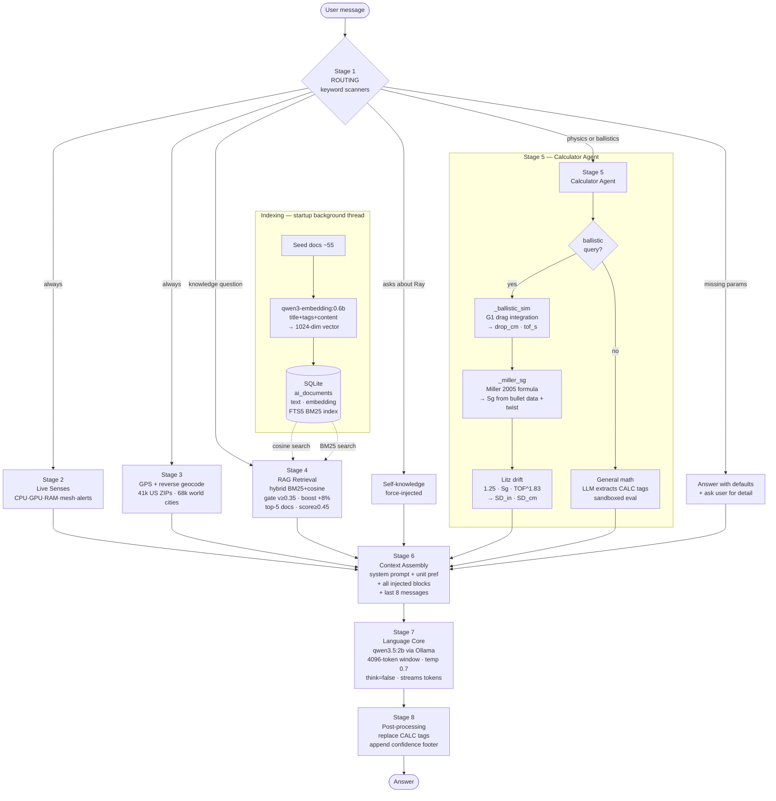

# Ray's Brain — How the Atlas Control AI Thinks

Ray is the local AI assistant inside Atlas Control. It runs **100% offline** on the
Jetson Orin Nano's GPU via [Ollama](https://ollama.com) — no internet, no cloud, no API keys.
Everything below lives in [`ai_manager.py`](ai_manager.py).

> **Ask Ray directly.** Ray carries a copy of this architecture in its knowledge base.
> Open the AI chat and ask things like *"how do you think?"*, *"how do you retrieve
> information?"*, *"explain your thought process"*, or *"why did you say that?"* —
> the self-architecture doc is force-injected and Ray explains itself in first person.

---

## Full Pipeline Diagram

```
╔══════════════════════════════════════════════════════════════════════════════╗
║                            YOUR MESSAGE                                      ║
╚════════════════════════════════╤═════════════════════════════════════════════╝
                                 │
          ╔══════════════════════▼══════════════════════╗
          ║        STAGE 1 — ROUTING                    ║
          ║   (keyword scanners, zero model cost)       ║
          ║                                             ║
          ║  ┌─────────────────────────────────────┐   ║
          ║  │ Is it about live system data?        │   ║
          ║  │ Is it a GPS / location question?     │   ║
          ║  │ Is it a math / physics expression?   │   ║
          ║  │ Is it a ballistic trajectory query?  │   ║
          ║  │ Is it asking about Ray itself?       │   ║
          ║  │ → answers can be multiple            │   ║
          ║  └─────────────────────────────────────┘   ║
          ║                                             ║
          ║  Also: if required parameters are missing   ║
          ║  (twist rate, zero dist, load data) →       ║
          ║  answer with defaults + ASK for the detail  ║
          ╚═══╤══════════════╤══════════╤══════════╤════╝
              │              │          │          │
     ┌────────▼──────┐  ┌────▼────┐  ┌─▼───────┐  │
     │  STAGE 2      │  │STAGE 3  │  │STAGE 4  │  │
     │  LIVE SENSES  │  │  GPS /  │  │   RAG   │  │
     │               │  │LOCATION │  │ RECALL  │  │
     │ • CPU/GPU/RAM │  │         │  │         │  │
     │   temps/power │  │M9N fix +│  │ hybrid  │  │
     │ • mesh nodes  │  │offline  │  │cosine + │  │
     │   online/off  │  │geocode  │  │ BM25    │  │
     │ • channels    │  │(41k US  │  │gate     │  │
     │ • recent msgs │  │ZIPs +   │  │v≥0.35  │  │
     │ • telemetry   │  │68k world│  │boost    │  │
     │ • topology    │  │cities)  │  │+8% cat  │  │
     │ • alerts      │  │         │  │top-5    │  │
     │               │  │user-    │  │≥ 0.45   │  │
     │(SQLite,fresh) │  │override │  │score    │  │
     └───────┬───────┘  └────┬────┘  └────┬────┘  │
             │               │            │        │
             │    ┌──────────┘            │        │
             │    │           ┌───────────┘        │
             │    │           │                    │
             │    │           │        ┌───────────▼──────────────────────────┐
             │    │           │        │       STAGE 5 — CALCULATOR AGENT     │
             │    │           │        │         (physics / math cortex)      │
             │    │           │        │                                      │
             │    │           │        │  BALLISTIC PATH ─────────────────►  │
             │    │           │        │  Parse from message:                 │
             │    │           │        │   • range (m/yd/ft)                  │
             │    │           │        │   • zero distance (default 100 m)    │
             │    │           │        │   • round/load (5.56, .308, etc.)    │
             │    │           │        │   • barrel twist (if specified)      │
             │    │           │        │                                      │
             │    │           │        │  G1 DRAG SIMULATION:                 │
             │    │           │        │   _ballistic_sim(range, zero,        │
             │    │           │        │     v0, bc_g1)                       │
             │    │           │        │   → integrate F=ma with G1 Cd table  │
             │    │           │        │   → bisect for zero elevation angle  │
             │    │           │        │   → return (drop_cm, tof_s)          │
             │    │           │        │                                      │
             │    │           │        │  SPIN DRIFT (Miller + Litz):         │
             │    │           │        │   Sg = 30·m/(n²·d³·L·(1+L²))        │
             │    │           │        │        × (v_fps/2800)^(1/3)          │
             │    │           │        │   SD_in = 1.25 · Sg · TOF^1.83      │
             │    │           │        │   (n = twist/diam, L = len/diam)     │
             │    │           │        │   Rightward for RH twist             │
             │    │           │        │                                      │
             │    │           │        │  GENERAL MATH PATH ──────────────►  │
             │    │           │        │   LLM pass at temp=0.05              │
             │    │           │        │   → extracts [CALC: expr] tags       │
             │    │           │        │   → sandboxed evaluator (no builtins)│
             │    │           │        │   → verified numbers injected        │
             │    │           │        │   → [CALC: x] in final answer        │
             │    │           │        │      replaced with computed value    │
             └────┼───────────┼────────┼─────────────┐                       │
                  │           │        │             │                       │
          ┌───────▼───────────▼────────▼─────────────▼───────────────────────▼──┐
          │                  STAGE 6 — CONTEXT ASSEMBLY                          │
          │                  (working memory for this reply)                     │
          │                                                                      │
          │  ┌──────────────────────────────────────────────────────────────┐   │
          │  │  SYSTEM PROMPT                                                │   │
          │  │  + UNIT PREFERENCE (metric/imperial — mandatory directive)    │   │
          │  ├──────────────────────────────────────────────────────────────┤   │
          │  │  SYSTEM STATUS (always injected)                              │   │
          │  │  CPU cores / GPU / RAM / disk / temps / power / uptime        │   │
          │  ├──────────────────────────────────────────────────────────────┤   │
          │  │  CURRENT POSITION (always injected)                           │   │
          │  │  GPS lat/lon + altitude + speed + nearest city (offline)      │   │
          │  ├──────────────────────────────────────────────────────────────┤   │
          │  │  MESH NETWORK STATE (conditional on question type)            │   │
          │  │  Node list / online+offline / battery / SNR / channel         │   │
          │  │  Last 10 messages / telemetry / topology / active alerts      │   │
          │  ├──────────────────────────────────────────────────────────────┤   │
          │  │  KNOWLEDGE BASE (RAG hits, if retrieval ran)                  │   │
          │  │  Up to 5 docs, hybrid score ≥ 0.45                           │   │
          │  ├──────────────────────────────────────────────────────────────┤   │
          │  │  SELF-KNOWLEDGE (force-injected if asking about Ray)          │   │
          │  ├──────────────────────────────────────────────────────────────┤   │
          │  │  CALCULATOR RESULTS (pre-verified numbers, if calc ran)       │   │
          │  │  + instruction: "use these exact values, do NOT recompute"    │   │
          │  ├──────────────────────────────────────────────────────────────┤   │
          │  │  CONVERSATION HISTORY — last 8 messages                       │   │
          │  └──────────────────────────────────────────────────────────────┘   │
          └──────────────────────────────────┬───────────────────────────────────┘
                                             │
          ╔══════════════════════════════════▼════════════════════════════╗
          ║         STAGE 7 — LANGUAGE CORE (qwen3.5:2b via Ollama)      ║
          ║                                                               ║
          ║  • Kept warm in VRAM (keep_alive = 10 h default)             ║
          ║  • 4096-token context window                                  ║
          ║  • Temperature 0.7, top_k 20, top_p 0.8                      ║
          ║  • Hybrid thinking DISABLED (think:false) — instant output    ║
          ║  • Streams tokens over local socket to app.py                 ║
          ║  • Cannot see the internet, only what's in context            ║
          ╚══════════════════════════════════╤════════════════════════════╝
                                             │
          ╔══════════════════════════════════▼════════════════════════════╗
          ║              STAGE 8 — POST-PROCESSING                       ║
          ║                                                               ║
          ║  • Replace any [CALC: expr] the model emitted with computed   ║
          ║    values (sandboxed eval — same evaluator as Stage 5)        ║
          ║  • Append CONFIDENCE FOOTER (cannot be faked):                ║
          ║      HIGH  — live data / self-doc / RAG score ≥ 0.70         ║
          ║      MEDIUM — system stats / RAG score 0.50–0.70             ║
          ║      LOW   — training knowledge only                          ║
          ║    + Source list: what was actually injected                  ║
          ╚══════════════════════════════════╤════════════════════════════╝
                                             │
                                    ╔════════▼════════╗
                                    ║     ANSWER      ║
                                    ╚═════════════════╝
```

---

## Indexing Pipeline (background, at startup)

```
SEED DOCUMENTS (ai_manager.py)
  ~55 docs across 9 topic clusters:
  Survival · Radio/Comms · Ballistics · Medical
  Firearms · Navigation · Wildlife · Atlas App · Ray Self-Doc
         │
         ▼
  For each doc with embedding = NULL:
  ┌────────────────────────────────────────────────┐
  │  Format: "title\ntags\n\ncontent"              │
  │  (embedding format v2 — metadata baked in)     │
  └────────────────────┬───────────────────────────┘
                       │
                       ▼
          qwen3-embedding:0.6b (Ollama)
          → 1024-dim float vector
                       │
         ┌─────────────▼──────────────┐
         │  SQLite: ai_documents      │
         │  ┌────────┬───────────┐   │
         │  │  text  │ embedding │   │
         │  │  BM25  │ (1024-dim)│   │
         │  │  index │  vector   │   │
         │  └────────┴───────────┘   │
         │                           │
         │  ai_documents_fts (FTS5)  │
         │  title ×10, tags ×5,      │
         │  content ×1               │
         └───────────────────────────┘
                       │
              Embedding cache (RAM)
              TTL: 120 s per query
              (avoids repeated DB reads
               for follow-up questions)
```

**When a doc is edited:** its `embedding` column is set to NULL. The background
thread detects this and re-embeds it on the next startup cycle. The FTS index
updates in the same transaction as the text write.

---

## Retrieval Pipeline (per query)

```
USER QUERY
    │
    ▼ embed with instruction prefix:
    "Represent this search query for retrieving relevant documents: {query}"
    → 1024-dim query vector (qwen3-embedding:0.6b)
    │
    ├──────────────────────────────────────────────────────┐
    │  COSINE SEARCH                        BM25 SEARCH   │
    │  dot(q, doc_i) / (|q|·|doc_i|)       FTS5 rank()   │
    │  for every doc in ai_documents        for top-N     │
    │  → v_i (raw cosine similarity)        → bm25_norm_i │
    └──────────────────────────────────────────────────────┘
                       │
                       ▼ HYBRID SCORING
    ┌──────────────────────────────────────────────────────────────┐
    │  semantic gate: if v_i < 0.35 → skip (BM25 cannot rescue it) │
    │  if v_i ≥ 0.35:                                              │
    │    hybrid_i = max(v_i, 0.6·v_i + 0.4·bm25_norm_i)           │
    └──────────────────────────────────────────────────────────────┘
                       │
                       ▼ TOPIC BOOST
    ┌──────────────────────────────────────────────────────────────┐
    │  _classify_query_category(query) →                           │
    │    keyword match → category (wildlife/medical/ballistics/…)  │
    │  docs whose tags contain category keywords → hybrid_i × 1.08 │
    └──────────────────────────────────────────────────────────────┘
                       │
                       ▼ GATE + RANK
    ┌──────────────────────────────────────────────────────────────┐
    │  keep docs where hybrid_i ≥ 0.45                            │
    │  sort descending → take top-5                                │
    │  confidence score = raw v_i of best doc (pre-boost, honest)  │
    └──────────────────────────────────────────────────────────────┘
                       │
              ┌────────▼────────┐
              │  Context block   │
              │  injected into  │
              │  Stage 6        │
              └─────────────────┘
```

---

## Calculator Agent — Ballistic Path (detail)

```
USER MESSAGE: "spin drift of a 5.56 at 600 m with 1:7 twist"
                            │
              _is_ballistic_query()  → True
                            │
       ┌────────────────────▼────────────────────────┐
       │          _ballistic_direct_compute()         │
       │                                             │
       │  1. Parse range  → 600 m                   │
       │  2. Parse zero   → 100 m (default)          │
       │  3. Parse twist  → 1:7" (explicit)          │
       │                                             │
       │  4. _identify_round("5.56")                 │
       │     → 5.56mm/.223 55gr FMJ (M193)           │
       │       v0=975 m/s, bc=0.269                  │
       │       weight=55gr, diam=0.224"              │
       │       length=0.910", ref_twist=9.0"         │
       │     (user specified 1:7 → override)         │
       │                                             │
       │  5. _ballistic_sim(600, 100, 975, 0.269)    │
       │     ┌──────────────────────────────────┐    │
       │     │ bisect elevation for y=0 @ 100m  │    │
       │     │ integrate F=ma with G1 Cd table  │    │
       │     │ dt = 0.005 s steps               │    │
       │     │ → drop_cm = -248.9 cm            │    │
       │     │ → tof_s   = 0.832 s              │    │
       │     └──────────────────────────────────┘    │
       │                                             │
       │  6. _miller_sg(55, 0.224, 0.910, 7.0, 975) │
       │     L_cal = 0.910/0.224 = 4.063 cal        │
       │     n     = 7.0/0.224  = 31.25 cal/turn    │
       │     Sg    = (30×55)/(31.25²×0.224³×        │
       │             4.063×(1+4.063²))              │
       │           × (3199/2800)^(1/3)              │
       │     → Sg = 2.21                            │
       │                                             │
       │  7. SD = 1.25 × 2.21 × 0.832^1.83         │
       │        = 2.76 × 0.706 = 1.95 in            │
       │        = 5.0 cm  [0.31 MOA]                │
       │                                             │
       │  8. Build BALLISTIC CALCULATOR RESULTS      │
       │     block → injected into Stage 6           │
       └─────────────────────────────────────────────┘
                            │
              INSTRUCTION block tells Ray:
              "use these exact numbers, do NOT recompute"
```

---

## Mermaid Flowchart (renders on GitHub)



---

## Stage by stage

### Stage 1 — Routing (`_is_location_query`, `_is_math_query`, `_is_physics_query`, `_is_ballistic_query`, `_is_self_query`)

Before any model runs, cheap keyword scanners classify the message simultaneously.
Multiple flags can fire at once (e.g. a ballistic question also gets live GPS context).
This stage also detects when key parameters are missing — if a ballistic query doesn't
include a zero distance or twist rate, the calculator uses sensible defaults and the
output block explicitly prompts the user to provide the missing value.

### Stage 2 — Live Senses (`build_context`)

The **first** injection is a `=== UNIT PREFERENCE ===` block (metric or imperial) read from
app settings. This governs every measurement in the answer — it is a mandatory directive,
not a suggestion. Hardware temperatures stay in °C regardless.

Every reply then gets fresh system stats (per-core CPU, GPU %, RAM, disk, temperatures,
power draw, uptime) and the live mesh picture from SQLite: node online/offline status,
battery, SNR, channels, the last 10 messages, and active alerts. Telemetry, positions,
and topology are only injected when the question asks for them — keeping the context lean.

### Stage 3 — Location Grounding (`_build_location_prefix`, `_reverse_geocode`)

The SparkFun M9N GPS fix is injected into **every** prompt, reverse-geocoded entirely
offline using a gravity-weighted lookup over 68,000 world cities (US: 41,000 ZIP-code
centroids, skipping military-base names when a civilian ZIP is close). If the user types
coordinates or a place name in their message, that overrides the device fix.

### Stage 4 — Indexing & Retrieval (RAG, hybrid BM25 + cosine)

**Indexing:** at startup, every seeded knowledge doc is run through `qwen3-embedding:0.6b`,
producing a 1024-dim vector stored next to the text in SQLite. Each document is embedded
as `"title\ntags\n\ncontent"` (embedding format v2) so metadata keywords like species names
and category tags are baked into the semantic fingerprint. A parallel **FTS5 full-text index**
(`ai_documents_fts`) is maintained for BM25 keyword search (title ×10, tags ×5, content ×1).
Changed docs are auto re-embedded. Embeddings are cached in RAM for 120 s.

**Retrieval uses a two-pass hybrid:**
1. Cosine similarity of query embedding vs every doc vector.
2. BM25 keyword search across the FTS index.

Hybrid score = `max(v, 0.6·v + 0.4·bm25_norm)` — **only** when cosine `v ≥ 0.35`
(the semantic plausibility gate). BM25 can rescue a near-miss semantic candidate
(e.g. exact term in title) but cannot surface an unrelated doc on keyword alone.

A topic router (`_classify_query_category`) applies a **+8% score boost** to docs whose
tags match the detected category (wildlife / medical / ballistics / etc.).

The **top 5 docs** with hybrid score ≥ 0.45 are pasted into context. The confidence
footer uses the raw pre-BM25 cosine score so it cannot be inflated by keyword luck.

### Stage 5 — Calculator Agent (`_calc_agent_pass`, `_ballistic_direct_compute`, `_miller_sg`)

Ray does not trust a 3B-parameter model with arithmetic. Two sub-paths:

**Ballistic trajectory path (`_ballistic_direct_compute`):**
- Parse range, zero, round, and twist from the message
- Identify the round from `_COMMON_ROUNDS` → get `(v0, bc, weight_gr, diam_in, length_in, ref_twist_in)`
- If user specified a twist rate (regex `1:N` or `one-in-N`), use it; otherwise use the round's `ref_twist_in`
- `_ballistic_sim(range, zero, v0, bc)` — real point-mass G1 drag integration, dt=5 ms
  - Bisects for the elevation angle that gives y=0 at zero distance
  - Returns `(drop_cm, tof_s)` from the actual simulation — no approximation
- `_miller_sg(weight_gr, diam_in, length_in, twist_in, v0_mps)` — Don Miller (2005):
  - `Sg = 30·m / (n²·d³·L·(1+L²)) × (v_fps/2800)^(1/3)`
  - where `n = twist/diam` (calibers/turn), `L = length/diam` (calibers)
- Litz spin drift: `SD_in = 1.25 · Sg · TOF^1.83`
  - Rightward for RH-twist barrels; reverse for LH-twist
- Output block includes the actual twist used, computed Sg, and a prompt to provide
  the exact barrel twist if the user wants a round-specific answer

**General math path:**
- First pass at temperature 0.05 extracts `[CALC: expression]` tags
- Sandboxed evaluator (math functions only, no builtins) computes each expression
- Verified numbers are injected with an instruction not to recompute
- Any `[CALC: expr]` Ray emits in its answer is also replaced post-generation

### Stages 6–7 — Context Assembly & Generation (`chat()` / `chat_stream()`)

The system prompt + all injected sections + the last 8 chat messages go to Ollama
(default `qwen3.5:2b`, 4096-token window, temperature 0.7, top_k 20, top_p 0.8,
hybrid-thinking disabled, kept warm in VRAM for 10 h).
The answer streams token by token over the local socket.

### Stage 8 — Confidence Footer (`_confidence_label`)

Every answer ends with `Confidence: HIGH|MEDIUM|LOW | Source: …` computed from what was
*actually* injected:

| Tier | Condition |
|------|-----------|
| HIGH | Live data or self-doc injected; or RAG cosine ≥ 0.70 |
| MEDIUM | System stats injected; or RAG cosine 0.50–0.70 |
| LOW | Training knowledge only (no RAG hit, no live data) |

Ray cannot inflate it — the footer is appended by Python after generation.

---

## Ammunition Data (`_COMMON_ROUNDS`)

Each round entry carries the physical bullet data needed for the Miller stability calculation.
No SG constants are hardcoded — Sg is derived from first principles per query.

| Round | v₀ (m/s) | BC (G1) | Weight | Diam | Length | Ref. Twist |
|-------|----------|---------|--------|------|--------|-----------|
| 5.56mm 55gr M193 | 975 | 0.269 | 55 gr | 0.224" | 0.910" | 1:9" |
| 5.56mm 62gr M855 | 930 | 0.307 | 62 gr | 0.224" | 0.990" | 1:7" |
| 5.56mm 77gr Mk262 | 884 | 0.372 | 77 gr | 0.224" | 1.060" | 1:8" |
| .308 Win 147gr M80 | 838 | 0.412 | 147 gr | 0.308" | 1.140" | 1:12" |
| .308 Win 168gr M118LR | 820 | 0.447 | 168 gr | 0.308" | 1.226" | 1:10" |
| .308 Win 175gr BTHP | 808 | 0.505 | 175 gr | 0.308" | 1.240" | 1:10" |
| .300 Win Mag 190gr | 932 | 0.560 | 190 gr | 0.308" | 1.350" | 1:10" |
| .300 Win Mag 220gr | 884 | 0.640 | 220 gr | 0.308" | 1.450" | 1:10" |
| 6.5mm CM 140gr | 869 | 0.626 | 140 gr | 0.264" | 1.196" | 1:8" |
| 6.5mm CM 130gr | 884 | 0.583 | 130 gr | 0.264" | 1.150" | 1:8" |
| .338 Lapua 250gr | 905 | 0.587 | 250 gr | 0.338" | 1.590" | 1:10" |
| .338 Lapua 300gr | 850 | 0.730 | 300 gr | 0.338" | 1.750" | 1:10" |
| .50 BMG 750gr | 895 | 1.050 | 750 gr | 0.510" | 4.180" | 1:15" |
| 9mm 115gr | 370 | 0.145 | 115 gr | 0.355" | 0.680" | 1:16" |
| .45 ACP 230gr | 259 | 0.195 | 230 gr | 0.452" | 0.800" | 1:16" |

---

## Memory Model

| Memory | Where | Lifetime |
|--------|-------|---------|
| Conversation history | SQLite (`ai_chats` / `ai_messages`) | Permanent; last 8 msgs per reply |
| Knowledge base | SQLite (`ai_documents`, text + embedding) | Permanent; re-embedded on edit |
| Doc-embedding cache | RAM | 120 s TTL |
| Model weights | VRAM | `keep_alive` (default 10 h) |
| Across separate chats | — | None — each chat is isolated |

---

## Knowledge Map

The **Knowledge Map** (Ray AI → Settings sub-tab) is a live SVG visualization of the
seeded documents and how they relate to each other.

- **Nodes** = documents, colored and grouped by topic cluster (Wildlife, Medical, Ballistics,
  Atlas App, etc.).
- **Edges** = cosine similarity ≥ 0.55 between document embeddings (up to 6 per node).
  Edge color shifts from slate (55 %) to amber (100 %) — warmer = more similar.
- **Click a node** to highlight its connections and see a ranked "Related" panel. Switch to
  the **"Read"** tab to view the full document text inline.
- **Drag nodes** to reposition; "Reset layout" restores the original radial arrangement.
- Edges appear only after re-embedding completes on startup.

---

## Honest Limits

- Routing is keyword-based; an oddly-phrased question can take the wrong path.
- Documents are embedded whole — no chunking — so retrieval is per-topic, not per-paragraph.
- Anything outside the knowledge base comes from the model's training data (marked LOW confidence).
- No internet: Ray cannot look anything up that isn't on the device.
- Ballistic spin drift assumes RH twist and sea-level standard atmosphere. Altitude, humidity,
  and barrel condition affect real-world results beyond what the model computes.
- If a critical input is missing (twist rate, specific load, zero distance), Ray answers with
  standard defaults and asks the user to provide the missing value for an exact answer.
